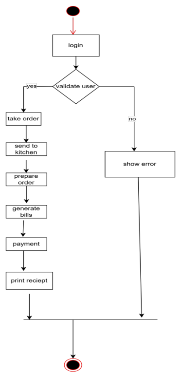
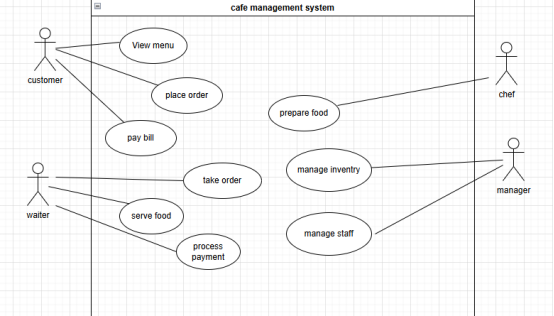

# Cafeteria Management System

## **Introduction**
The **Cafeteria Management System** is a professional desktop application designed to streamline the daily operations of a modern cafeteria or small restaurant. Built with Java Swing, the system provides a comprehensive suite of tools for managing orders, menu items, inventory, staff, and customer relationships. It features a responsive, Material-inspired UI that adapts to various screen sizes, ensuring a smooth user experience for both administrators and operational staff.

---

## **Methodology**
The project followed an **Agile Iterative Development** methodology. This approach allowed for continuous integration of new features based on evolving requirements. Key practices included:
- **Incremental Feature Delivery**: Core modules (Ordering, Billing) were developed first, followed by advanced features (Analytics, Staff Management).
- **Refactoring & Code Quality**: Applied standard design patterns (Singleton, Observer) and addressed code smells like "Large Class" and "Duplicate Code" by modularizing the UI into specialized panels.
- **User-Centric Design**: Focused on high-contrast visibility, responsiveness, and intuitive navigation.

---

## **Functional Requirements**
### **1. User Authentication & RBAC**
- Secure login system for **Admin** and **Staff** roles.
- Role-Based Access Control (RBAC) to restrict sensitive modules (Inventory, Reports, Staff Mgmt) to administrators only.
- Functional logout and session management.

### **2. Order & Menu Management**
- Create and track orders through a lifecycle: **Pending → Preparing → Completed**.
- Full CRUD (Create, Read, Update, Delete) operations for the cafeteria menu.
- Categorization of items (Coffee, Snacks, Desserts, etc.).

### **3. Billing & Payment**
- Automatic calculation of subtotals, taxes, and discounts.
- Support for multiple payment methods: **Cash, Card, and Online**.
- Automated digital receipt generation and download (.txt format).

### **4. Inventory & Supplier Management**
- Real-time tracking of ingredient stock levels.
- Automated **Low Stock Alerts** based on customizable thresholds.
- Management of supplier details linked to specific inventory items.

### **5. Table & Customer Management**
- Visual table grid with real-time occupancy status (Available vs. Occupied).
- Customer database with order history tracking.
- **Loyalty Program**: Automatic point accumulation (1 point per $10 spent).

### **6. Reports & Analytics**
- Textual and **Graphical (Bar Charts)** reports for Daily Sales and Monthly Revenue.
- Analytics for best-selling items to inform menu decisions.

---

## **Non-Functional Requirements**
- **Responsiveness**: The UI dynamically adjusts its sidebar and layout for Desktop, Tablet, and Mobile window widths.
- **Maintainability**: Modular architecture with decoupled UI components and a centralized data repository.
- **Usability**: High-contrast professional theme with clear typography and intuitive iconography.
- **Reliability**: Guard clauses and validation logic to prevent data integrity issues (e.g., negative stock or empty orders).

---

## **Project Structure**
The project is organized into a clean, modular package structure:

```text
src/main/java/com/cafeteria/system/
├── MainFrame.java           # Entry point & Main Navigation Shell
├── CafeteriaData.java       # Singleton Data Repository (State Management)
├── UIUtils.java             # Centralized UI Styling & Constants
├── UserManager.java         # Authentication & Session Logic
├── NotificationManager.java  # Centralized Alert System
├── ChartPanel.java          # Custom Graphics for Analytics
├── Panels/                  # Modular UI Components (Logic & View)
│   ├── DashboardPanel.java
│   ├── OrderPanel.java
│   ├── InventoryPanel.java
│   ├── CustomerPanel.java
│   ├── StaffPanel.java
│   ├── TablePanel.java
│   ├── ReportsPanel.java
│   └── MenuManagementPanel.java
└── Models/                  # Core Business Entities
    ├── Order.java
    ├── MenuItem.java
    ├── Inventory.java
    ├── Customer.java
    ├── User.java (Admin, Staff, Cashier subclasses)
    └── Enums (Status, UserRole, PaymentMethod)
```

---

## **How to Run**
1. **Compile**: `javac -d bin src/main/java/com/cafeteria/system/*.java`
2. **Run**: `java -cp bin com.cafeteria.system.MainFrame`
3. **Test Credentials**:
   - **Admin**: `admin` / `admin123`
   - **Staff**: `staff` / `staff123`
Screen shots
         
UML Diagrams
Class Diagram

Activity Diagram

Usecase Diagram

